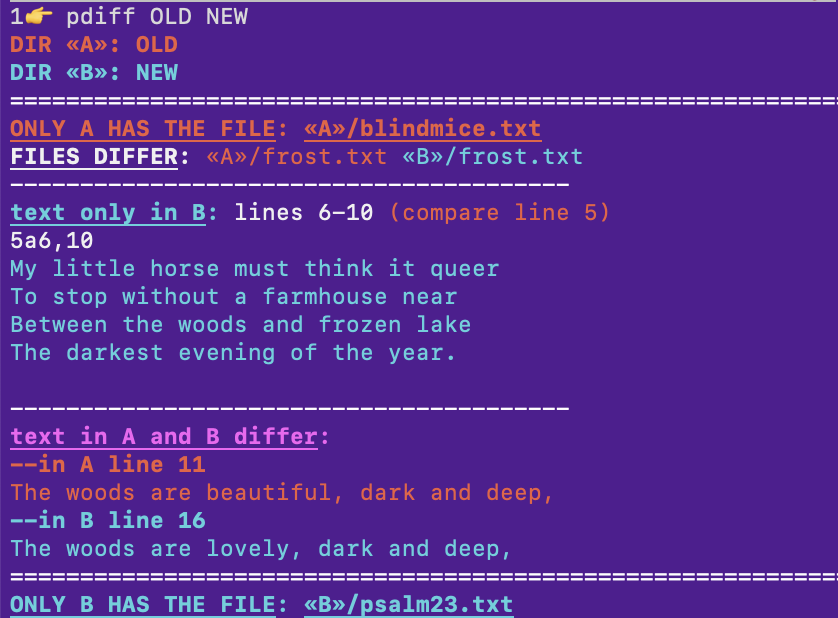

pdiff is a command-line function, which restyles the output of the FSF's "diff" function for easier (IMO) reading, especially when applied to directories.  

It uses color to distinguish between elements from the two directories:

The command accepts most flags accepted by diff.
You can also use a "-b" flag to have a "brief" listing, omitting the file-by-file differences.

To try it out, move into the `pdiff` directory and type `./pdiff dir1 dir2`.

To install, move the file `pdiff/pdiff` into your executable path,
and then move the `pdiff` folder to your Python path.

