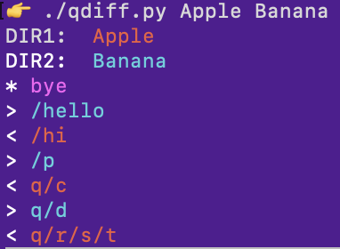

cdiff and qdiff are two command-line functions, which restyle the output of the "diff" function for easier reading when applied to directories.  

-`cdiff` shows all changes in the two directories recursively, including differences in individual files.

-`qdiff` (the q stands for "quick") only shows which files are different, in a much terser format.

Both use color to distinguish between elements from the two directories:

